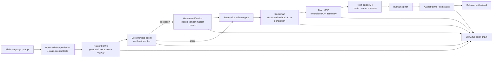

# VeriRemit

VeriRemit is a source-grounded vendor payment-change verification workflow built from scratch for the DevNetwork API + Cloud + AI Hackathon 2026.

It detects suspicious vendor bank-account changes from business documents, shows the evidence behind each conflicting fact, blocks consequential actions with deterministic policy, and requires verified human approval before a signature workflow can proceed.

## Hackathon targets

- **Nutrient:** grounded document extraction, confidence/provenance, and short-lived evidence viewing.
- **Doctavian:** structured generation of the approved Payment Release Authorization from deterministic case data.
- **Foxit:** reversible PDF assembly through the official stdio MCP server, followed by a separate direct eSign API boundary for the real human signature.

The plain-language reviewer uses **Groq `openai/gpt-oss-120b` through the OpenAI Agents SDK** when `GROQ_API_KEY` is configured. The model has only four case-scoped tools and does not own the release decision. An OpenAI model remains an optional fallback, not a requirement for the zero-cost hackathon path.

Fixture mode is clearly labeled and exists only for deterministic development/tests. Sponsor claims are considered live only after the credential-gated checks in `docs/verification/live-provider-checklist.md` pass.

## Safety boundary

The model does not decide whether a bank-account mismatch exists and cannot sign or authorize payment. VeriRemit uses deterministic rules for document comparison, a server-side case-state gate, trusted-contact verification from the vendor master, and a hash-chained audit ledger. Only after the release gate passes may structured approved data be sent to Doctavian for document generation. Foxit MCP then performs reversible packet assembly, and the agent may request a Foxit eSign envelope through the direct API. The actual signature remains a human action and final completion is accepted only from Foxit's authoritative status API.

## Architecture at a glance



The language model never owns the bank-change decision, never receives a signing capability, and never authorizes payment. Provider-specific operations remain behind typed adapters and server-side state gates.

## Repository layout

```text
apps/web                         reviewer workbench (React/Vite)
apps/agent                       Fastify API, case orchestration, bounded reviewer,
                                 Doctavian generation composition
packages/domain                  case and evidence types/state transitions
packages/policy                  deterministic verification/release rules
packages/audit                   tamper-evident audit chain
packages/integrations/nutrient   extraction + DWS Viewer adapters
packages/integrations/foxit-mcp  reversible release-packet MCP integration
packages/integrations/foxit-esign direct human-signature API integration
fixtures/acme-components         synthetic hackathon evidence packet
docs/verification               sanitized provider verification status
```

## Local setup

Prerequisites:

- Node.js `>=22.12.0`;
- npm;
- provider credentials only when exercising the corresponding live paths.

Install the workspace dependencies and create a local environment file:

```bash
npm ci --ignore-scripts --no-audit --no-fund
cp .env.example .env.local
npm run generate:fixtures
```

`VERIREMIT_PROVIDER_MODE=fixture` is the default. Fixture mode uses only the clearly marked synthetic PDFs for sponsor-provider behavior; it never counts as live sponsor evidence. The bounded natural-language reviewer uses Groq when `GROQ_API_KEY` is set; `OPENAI_API_KEY` is an optional fallback.

Start the long-lived agent/API from the repository root so Node can optionally load `.env.local` without an extra dotenv dependency:

```bash
node --env-file-if-exists=.env.local --experimental-strip-types apps/agent/src/main.ts
```

In a second terminal, start the reviewer workbench:

```bash
npm run dev --workspace @veriremit/web
```

The agent defaults to `http://localhost:8787`; Vite prints the local web URL when it starts. For a split deployment, set `VITE_API_BASE_URL` in the web build and the matching exact `VERIREMIT_WEB_ORIGIN` on the agent.

### Live sponsor mode

Set `VERIREMIT_PROVIDER_MODE=live` plus the required server-side values from `.env.example`:

- `GROQ_API_KEY`;
- `NUTRIENT_API_KEY` and `NUTRIENT_DWS_VIEWER_API_KEY`;
- `DOCTAVIAN_API_KEY` and `DOCTAVIAN_ACCESS_TOKEN`;
- `FOXIT_CLIENT_ID` and `FOXIT_CLIENT_SECRET`;
- `VERIREMIT_SIGNER_EMAIL`.

Doctavian's hackathon demo contract requires both its provisioned API key and an OAuth bearer token. Do not expose any provider credential to the browser or commit `.env.local`.

Generate the canonical ACME Postman inputs without live credentials:

```bash
npm run generate:doctavian-artifacts
```

The command writes `artifacts/doctavian/veriremit-release-template.docx` and `artifacts/doctavian/veriremit-release-data.json`.

Before recording or claiming sponsor integration, run the credential-gated checks in `docs/verification/live-provider-checklist.md`.

## Verification

Offline verification (no sponsor credentials required):

```bash
npm run verify:offline
```

Reset local demo state and regenerate the deterministic synthetic packet before a fresh recording/test run:

```bash
npm run demo:reset
```

Live sponsor smokes are intentionally separate:

```bash
npm run smoke:groq
npm run smoke:nutrient
npm run smoke:doctavian
npm run smoke:foxit:mcp
npm run smoke:foxit:esign
```

They fail closed if their credentials are absent and never substitute fixture results for provider proof.

## Deployment

The static web layer may be deployed separately, while the live agent should run as a long-lived Node service because it owns Foxit's stdio MCP child process. `Dockerfile.agent` packages the agent for that topology and defaults to fixture mode so live providers are opt-in through runtime secrets.

See `docs/deployment.md` for the exact topology, environment variables, persistence path, and verification sequence.

Submission copy, judging coverage, and the exact 2-4 minute recording flow live in `docs/submission/`.

## Current status

The deterministic workflow, fixture demo, Groq reviewer provider, Nutrient/Foxit adapters, Doctavian generation adapter/template/composition, UI, CI safeguards, and deployment packaging are implemented. The current clean-run baseline is **123/123 tests passing**, 0 high-or-greater production dependency vulnerabilities, strict core/provider/app typechecks, a production Vite build, a clean repository secret scan, **2/2 Chromium end-to-end tests passing with retries disabled**, a successful `Dockerfile.agent` build, and a fixture-mode container startup that returns HTTP 200 from `/health`.

Live provider evidence now exists for the real **Groq bounded reviewer**, **Nutrient grounded extraction + DWS Viewer**, **Foxit PDF Services MCP**, and the complete **Foxit direct eSign human-signature round trip**. The Foxit developer-test envelope reached authoritative `EXECUTED` state and provider activity history independently recorded the signer action. **Doctavian remains PENDING LIVE RETEST**: Microsoft OAuth and the API key are accepted, `/v1/common/user/get` returned 200, and both multipart template/data uploads returned 201. The latest generation request reached Doctavian's document layer but returned 500 `TEMPLATE_READ_FAILED`. The former three-part hand-built DOCX and its repeater syntax have been replaced with a standard package generated by pinned `docx@9.7.1`; local structural compatibility now passes, but only a fresh 201 generation plus 200 non-empty PDF download can promote the provider to PASS.

Until that Doctavian smoke passes, VeriRemit does **not** claim that the canonical Nutrient -> Doctavian -> Foxit chain has completed end-to-end against every live sponsor provider. The final hackathon demo video is intentionally gated on that last proof.

A public hosted agent is optional for the current sponsor submission criteria and is not represented as verified. VeriRemit is intentionally **hackathon-production-shaped, not represented as regulated-production-ready**. The current live runtime is designed for one controlled long-lived instance. Dependency resolution is locked and CI/Docker use `npm ci`; a real multi-user production deployment still needs upstream authentication/rate limiting, transactional durable storage with cross-instance idempotency, and an externally anchored or signed audit store.

## License

MIT. See `LICENSE`.
